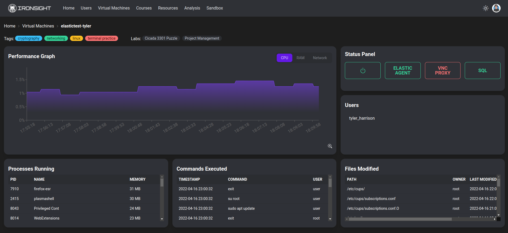

# Ironsight

An all-in-one toolkit that allows for visualization of various information being collected from kernel-based virtual machines (KVMs). Ironsight's main focus is cybersecurity in an educational environment, specifically targeting the visualization of data being collected in a cyber range.

## Installation

Use the package manager [npm](https://docs.npmjs.com/downloading-and-installing-node-js-and-npm/) to install the requirements.

```bash
npm install
```

## Usage

If you are using this for development purposes, it is recommended to run using:

```bash
npm start
```

Otherwise, it is ok to build the webpage for deployment purposes:

```bash
npm build
```

After building/compiling the project, it can be served just like any other web page on your own machine or in a dedicated web server

## UI/UX Design

### Homepage


### Virtual Machine Details



### VM Creation


### Course User Layout


## Contributing

Pull requests are welcome. For major changes, please open an issue first to discuss what you would like to change.

Please make sure to update tests as appropriate.

## Credits

This project was created by a group of students at Texas A&M-Commerce for Systems Analysis & Design (CSCI 359)

- Truman Brown
- Tyler Harrison
- Sudip Koirala
- Augustine Solis

## License

[MIT](https://choosealicense.com/licenses/mit/)