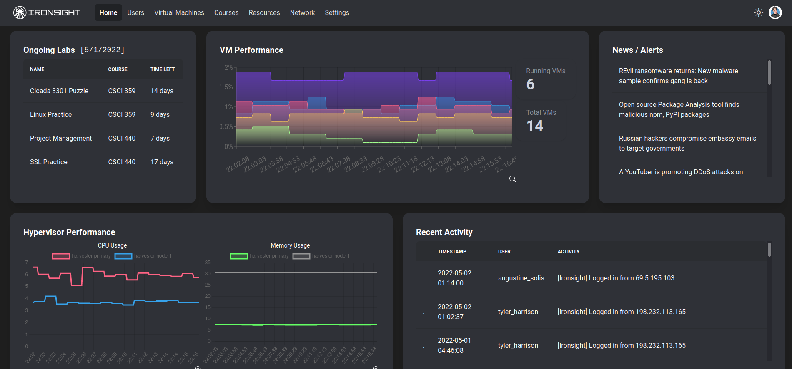

# Ironsight

An all-in-one toolkit that allows for visualization of various information being collected from kernel-based virtual machines (KVMs). Ironsight's main focus is cybersecurity in an educational environment, specifically targeting the visualization of data being collected in a cyber range.

## Installation

Clone the repository to any directory

```bash
git clone git@github.com:tamuc-ironsight/ironsight.git
```

Naviagate to the directory in a terminal and use the package manager [npm](https://docs.npmjs.com/downloading-and-installing-node-js-and-npm/) to install the required libraries. You may need to use the `--force` flag due to some dependencies not yet documenting support for React 18 in their manifests.

```bash
npm install
```

## Configuration

The only thing needed for configuration of the Ironsight web dashboard is the `.env` file in the main directory of the project. It contains the following:

```bash
REACT_APP_API_SERVER=
```

In order for any data to flow to the dashboard, this must be set to the domain or IP address hosting the [Ironsight API Handler](https://github.com/tamuc-ironsight/ironsight-api-handler). We recommended using a secure connection (https) for any production environments.

## Usage

If you are using this for development purposes, running the following will open a web browser and allow you to make live changes to the code:

```bash
npm start
```

For production environments, build the webpage for deployment:

```bash
npm build
```

After building/compiling the project, it can be served just like any other web page on your own machine or on a dedicated web server. To test your build, run:

```bash
npm serve
```

You can test to see if the built version of Ironsight works by opening a web browser at the specified address listed in the terminal.

## UI/UX Design

### Homepage



### Virtual Machine Details


### VM Creation


### Course User Layout


## Contributing

Pull requests are welcome. For major changes, please open an issue first to discuss what you would like to change.

Please make sure to update tests as appropriate.

## Credits

This project was created by a group of students at Texas A&M-Commerce for Systems Analysis & Design (CSCI 359)

- Truman Brown
- Tyler Harrison
- Sudip Koirala
- Augustine Solis

## License

[MIT](https://choosealicense.com/licenses/mit/)